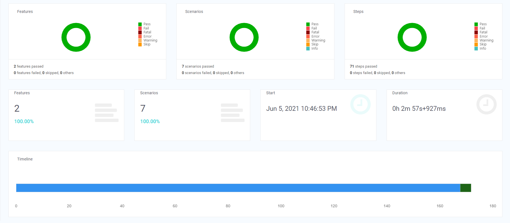
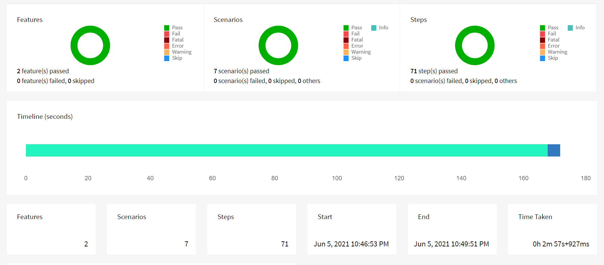
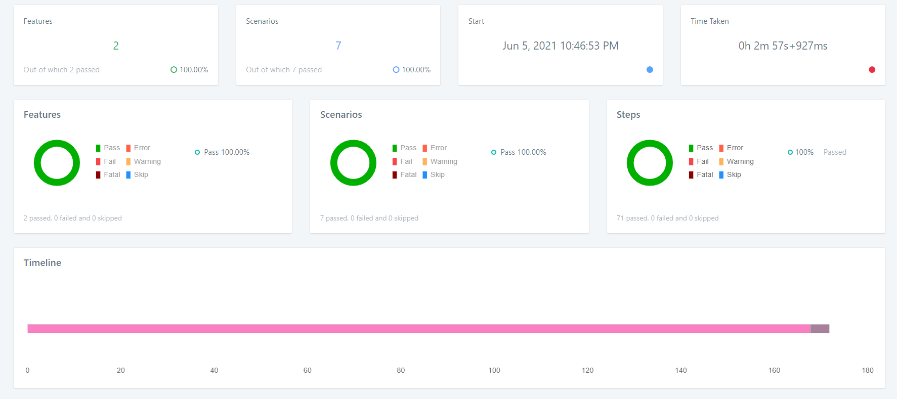

Trello - CRUD Operations for UI and Backend
---

Java-based test automation framework built on top Selenium WebDriver to initialise the Chrome Browser for the CRUD Operations.

## Frameworks & Tools

Java 8

Selenium WebDriver

JUnit

Cucumber (BDD) / Gherkin

Maven

Rest Assured

### Steps to run

 1) Run as Maven Application via command prompt
    
        mvn clean verify
    
 2) Run via Elicpse
    
        nl.knab.trello.runner.TrelloRunner

### Steps to test the application

 1) Application URL: https://trello.com/
    
 2) Enter the new board name in the 01_ui_create_board.feature
    
 3) Separate selenium chromedriver is not required, as framework handle the application to run by setup the ChromeDriver via the ChromeDriverManager
    
 4) Backend scenario's will run from the feature 05_api_board_action.feature for CRUD operations

### Application Test Reports

 1) Spark Report under test-output/Selenix-Spark

   

 2) HTML Report under test-output/HtmlReport
     
   
    
 3) Logger Report under test-output/Selenix-Logger

    

  
   